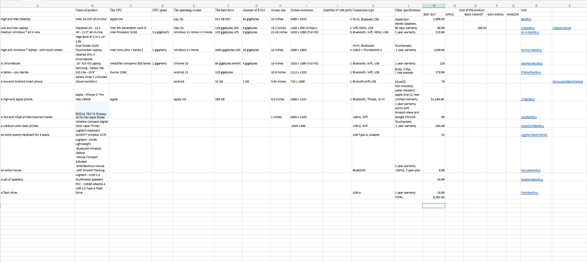

# CS105/6/7/8 Portfolio
# FirstName LastName
Oselunosen Ehi-Douglas
## Portfolio
Contact Info: 443 266 1290

### About Me 
Hello! I am an experienced Computer Science Student and IT adminstartor assistant with over 3 years of proven expertise in Computer Science and Specialization in Software Engineering. 
 
With skills in Problem Solving, Agile software development, data structures , and Tecnical communication, I am able to code Apps and webpages, and achieve reliable and scalable application performance. I am adept at using C, Java, databases(MySQL, Postgres) and Javascript programming languages. 
 
My technical skill set, commitment to continuous learning, and passion for software developmet makes me as a valuable asset.  In my spare time, I like to Play video games and  football. 

You can find me on [[LinkedIn Hyperlink](https://www.linkedin.com/in/oseje-ehi-douglas-90428b328/)].

### Education 
Bachelors of Computer Science Loyola University Maryland 2026
***
### Projects

#### Project 1 Title

 - Project 1 Summary
 - [insert project 1 screenshot here]
 - Project 1 Report
***
#### Project 2 Title
 - Project 2 Summary
 - [insert project 2 screenshot here]
 - Project 2 Report
***
#### Project 3 Title
 - Project 3 Summary
 - [insert project 3 screenshot here]
 - Project 3 Report
