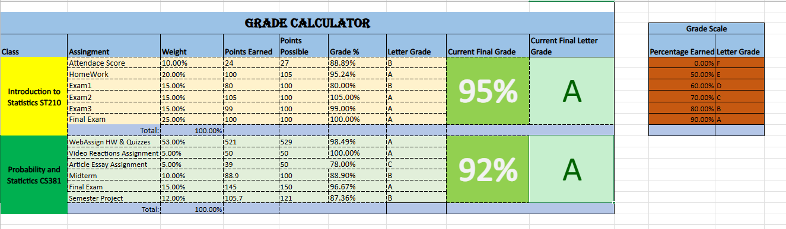
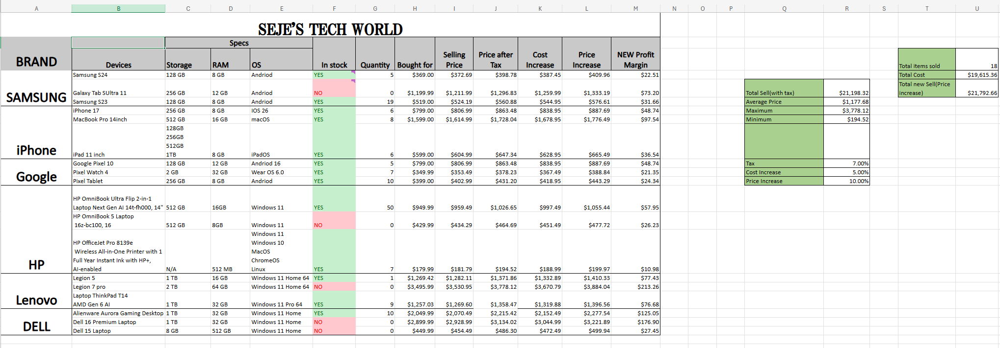
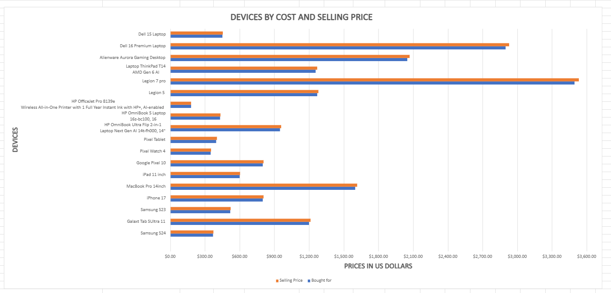
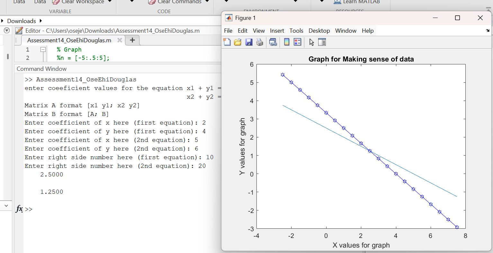
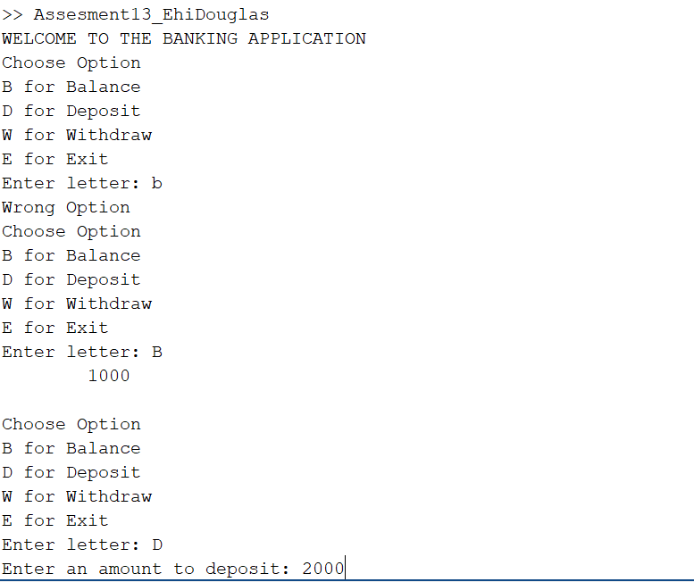
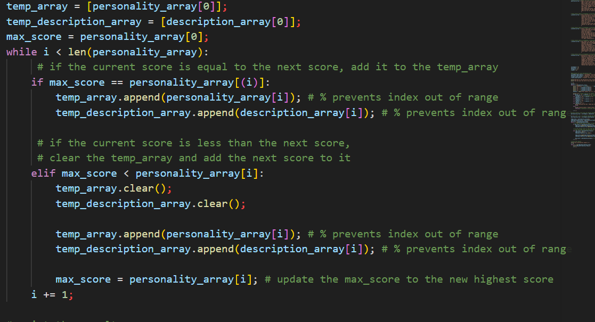
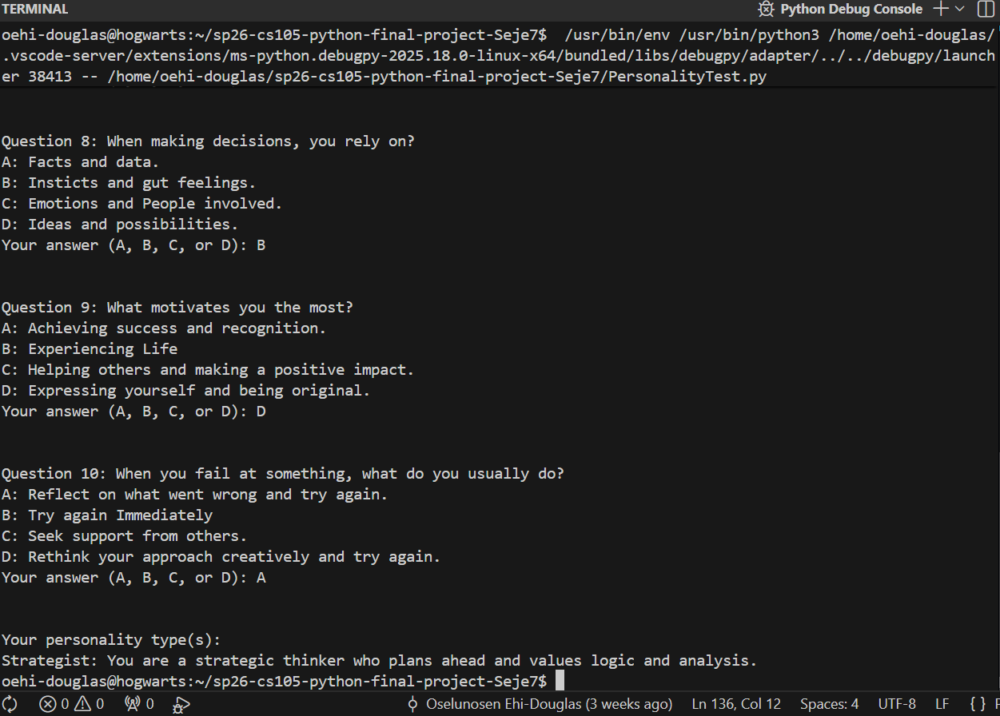

# CS105/6/7/8 Portfolio
# Oselunosen Ehi-Douglas

## Portfolio
Contact Info: 443-216-1290

### About Me 
Hello! I am an experienced Computer Science Student and IT adminstartor assistant with over 3 years of proven expertise in Computer Science and Specialization in Software Engineering. 
 
With skills in Problem Solving, Agile software development, data structures , and Tecnical communication, I am able to code Apps and webpages, and achieve reliable and scalable application performance. I am adept at using C, Java, databases(MySQL, Postgres) and Javascript programming languages. 
 
My technical skill set, commitment to continuous learning, and passion for software developmet makes me as a valuable asset.  In my spare time, I like to Play video games and  football. 

You can find me on [LinkedIn Hyperlink](https://www.linkedin.com/in/oseje-ehi-douglas-90428b328/).

### Education 
Bachelors of Computer Science Loyola University Maryland 2026
***
### Projects

#### Excel
-  These projects were developed to strengthen my understanding of mathematical computation, data organization, and logical workflows using Microsoft Excel. The first project focused on calculating and evaluating grades for two courses taken during a semester, while the second project was designed to help a sales retailer track inventory and analyze product profitability.

    The grade calculator project used Excel’s built-in formulas and conditional formatting features to automatically calculate final grades, assign letter grades, and apply color coding based on performance. One challenge I encountered was maintaining a consistent color scheme for the grade categories. Initially, the formatting rules caused inconsistencies, but I was able to resolve the issue by refining the conditional formatting logic.

    The second project was a sales inventory tracker that organized product information collected from technology retail sources such as Back Market and Best Buy. I used Excel formulas to calculate selling price after tax, cost increases, and profit margins. I also created a bar chart to visually compare product cost and selling price, providing a clearer understanding of inventory performance. This project did not present significant challenges but helped reinforce spreadsheet organization and data visualization techniques.

    Both projects achieved their intended goals. The grade calculator accurately computes student performance, assigns letter grades, and visually highlights results through conditional formatting. The inventory tracker allows sales managers to monitor products, estimate potential profit or loss, and view graphical representations of pricing data. These projects improved my skills in Excel formulas, conditional logic, graph implementation, and mathematical calculations. If I were to expand on these projects, I would focus on improving the overall design and visual presentation to create a more polished and user-friendly experience.
 
 - PROJECT SCREENSHOTS
    
    *Grade calculator for student Courses*   
    
    *Excel sheet showing devices, their specs,cost and selling price*   
    
    *Horizontal Bar Chart showing Devices by Cost and Selling Price*

 - Project Link
    [GradeCalculator](https://studentsloyola-my.sharepoint.com/:x:/g/personal/oehi-douglas_loyola_edu/IQAM9xazEerqRYihN14bwluwAZF6vIEW56W6iIrXSHq-NoU?email=cinweke%40loyola.edu&e=IYNNBy)
    [InventoryManager](https://studentsloyola-my.sharepoint.com/:x:/g/personal/oehi-douglas_loyola_edu/IQAM9xazEerqRYihN14bwluwAZF6vIEW56W6iIrXSHq-NoU?email=cinweke%40loyola.edu&e=IYNNBy)
***
#### Mathlab
 -  These projects were developed to strengthen my understanding of user interaction, mathematical computation, and logical program flow using MATLAB. The first project focused on solving and graphing systems of linear equations, while the second project simulated a simple banking application that allows users to manage deposits, withdrawals, and account balances through a menu-driven interface.

    The graphing project was created to provide a way for users to input coefficients for two linear equations, automatically solve the system using matrix operations, and visualize the results through plotted graphs. The banking application addressed the need for a simple transaction management system where users could interactively check balances and perform banking operations.

    The projects were built using MATLAB for coding, calculations, graph plotting, and user input handling.

    The main challenge occurred in the graphing project, particularly with validating and handling user input as well as correctly calculating the y-values for plotting the equations. This required careful use of formulas and variable management to ensure accurate graph representation.No additional resources or collaborations were used during the development of these projects.

    Both projects achieved their intended goals. The graphing application successfully solved and visualized linear equations, while the banking application provided a functioning menu-driven simulation of account transactions. Together, these projects improved my understanding of mathematical programming, loops, conditionals, and interactive user input handling.

 - PROJECT SCREENSHOTS
    
    *Matrix Calculation to solve Linear Equation*
    
    *ATM Machine Project*

 - Project Link
    [MathLabGraph](MatlabProject/Assessment14_OseEhiDouglas.m)
    [MathLabATM](MatlabProject/Assesment13_EhiDouglas.m)

***
#### Personality Quiz
 -  I created a Personality Test program that asks users a series of multiple-choice questions to determine their personality type. The program evaluates responses and categorizes users into one or more personality groups such as Strategist, Adventurer, Caregiver, or Creator. The goal was to design an interactive console-based application that combines user input, decision-making, and data processing in a structured way.

    What problem did you set out to solve, and why was it a problem that needed to be solved?
    The project was designed to solve the problem of creating an engaging and automated way to evaluate personality traits through a questionnaire. Instead of manually interpreting answers, the program provides a quick and consistent method for collecting responses, calculating results, and presenting personality outcomes. This project also served as a way to practice handling user input, loops, arrays, and conditional logic in programming.

    I used Visual Studio Code to write and test the program. I also used Git for version control and uploading the project.

    One of the main challenges was comparing the final personality scores and correctly mapping answers to their associated personality categories. I overcame this by using arrays and loops to organize the questions, answer options, and scoring system. This allowed the program to efficiently track responses and determine the highest-scoring personality type(s).

    I completed this project independently without collaborating with others or using external assistance beyond standard documentation and programming references.

    The goal of the project was to successfully create a functioning personality assessment program that accepts user responses and calculates personality results. I achieved this goal by building a fully working console-based application. If I were to continue developing this project, I would add a graphical user interface (GUI) to improve usability and create a more interactive experience for users.

 - PROJECT SCREENSHOTS
    
    *Calculation for Max Personality*    

    
    *Final Result of Personality Quiz*

 - Project Link
    [Personality Quiz](https://github.com/LoyolaUnivMD/sp26-cs105-python-final-project-Seje7)
